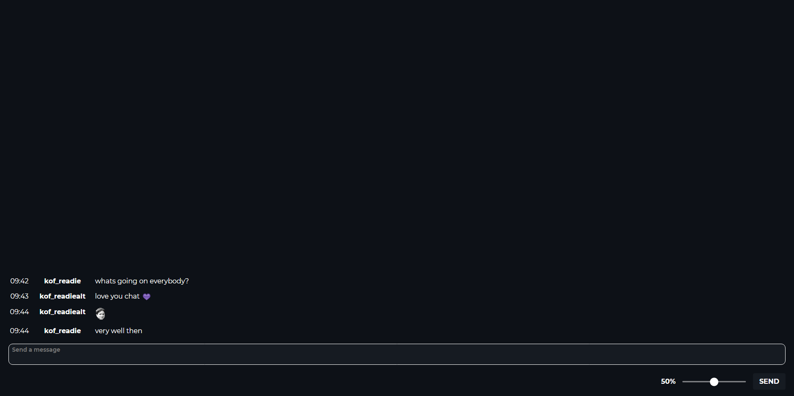

# AWS-Stream-Tools
### A stream chat tool that features AWS text to speech, voice commands, chat filters and more! Check it out [here](http://readie.global-gaming.co/stream-tools/)!

## Please Note:
THIS IS STILL IN A VERY EARLY STAGE OF DEVELOPMENT. There will be many more features to come in the future and these docs are likley to change as development goes on.  
You will also need to log-in to my server to **save** your credentials, which can be done by clicking at the top of the page and opening the account window. In the future I will add an option to save your details to the local machine only, data for this webapp is currently **not encrypted** however your user account password **is encrypted**.
If you have any issues or sugguestions feel free to message me: kOF.Readie#6594.

## Features:
### Chat table:

Displays all of your Twitch chat with emotes (BTTV and FFZ emote parsing WIP). Messages are displayed by the time they are recieved on by the client followed by the sender name and message.  

To setup the chat table you must log-in with your Twitch username and oAuth Token which you can obtain from Twitch's oAuth token generator [here](https://twitchapps.com/tmi/).  
[**PREVIEW**](https://cdn.global-gaming.co/v/readie/stream-tools/open%20settings.mp4)

### Text To Speech:
**Please note:** currently in order to use this you must have an AWS account, you can read about how to get one [here](/AWS%20Setup.md).  
To enable the text to speech go to Settings > Text To Speech.  
Using AWS Polly I have implimented text to speech. The voice is currently limited to Brian's but in the future I will unlock other voices as well as WebSpeechAPI voices, so you dont need to go through the AWS setup if you don't want those voices.  
[**PREVIEW**](https://cdn.global-gaming.co/v/readie/stream-tools/tts.mp4)

The TTS also has text filters:
| Method | Info |
| --- | --- |
| Remove | Removes the words to filter from the message |
| Skip | Skips reading the message if it contains a filter word |

### Voice Commands:
**Please note:** that not all browsers support speech synthesis.  
To enable the voice commands go to Settings > Voice Commands.  
The activator for the voice commands are currently the following: `stream tools, st`.  
I will add the option for the user to use their own activators in the future.
| Command | Info |
| --- | --- |
| mute | Mutes the TTS |
| unmute | Unmutes the TTS |
| volume [0-100] | Sets the volume of the tts to the number said |
| send [message] | Sends the spoken message to your twitch chat |
| skip | Skips the current TTS message |

[**PREVIEW**](https://cdn.global-gaming.co/v/readie/stream-tools/vc.mp4)